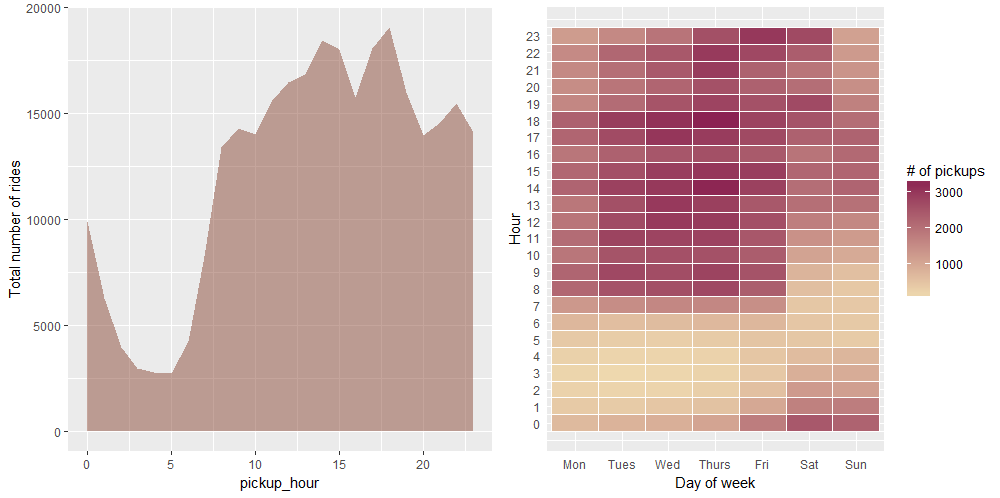
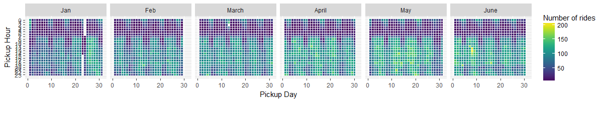
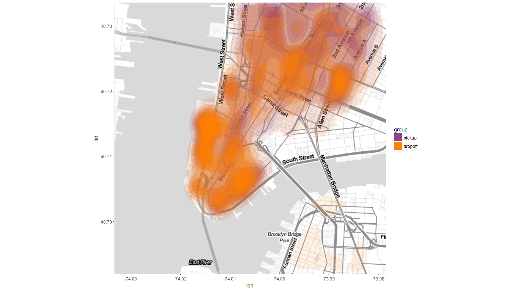

# Data visualization of taxi rides (R and Python)

 <iframe src="http://bl.ocks.org/AndrewRP/raw/7468330/" marginwidth="0" marginheight="0" scrolling="no"></iframe>

R libraries (ggmap, ggplot) and Python's Folium package are used to visualize the <a href= 'https://www.kaggle.com/c/nyc-taxi-trip-duration'>taxi data set</a> from Kaggle. The goal is to explore and compare the different mapping features within R and Python. The main difference between R's library and Python's Folium is that Folium's inline plot is more interactive (i.e., customized popup, zoom), whereas interactivity within R environment is best delivered via Shiny. However it takes longer for Folium to plot and load the map than R's ggmap due to high memory requirement. The ggmap library, on the other hand, seems to have more options for color schemes and other visualization features that are easy to use. 

NOTE: For the HTML report of the R code, visit https://rawgit.com/yinniyu/kaggle_taxi/master/taxi_data_visual.html. For the jupyter notebook file it's best to view it on NBviewer using Firefox to render the Folium interactive maps. http://nbviewer.jupyter.org/github/yinniyu/kaggle_taxi/blob/master/Python_taxi_map.ipynb

### R visualization 
 
The dataset is relatively small in terms of number of features. Here's a glimps of the data:

|id|vendor_id|pickup_datetime|dropoff_datetime|passenger_count|pickup_longitude|pickup_latitude|dropoff_longitude|dropoff_latitude|store_and_fwd_flag|trip_duration|
|:-------------:|:-------------:|:-------------:|:-------------:|:-------------:|:-------------:|:-------------:|:-------------:|:-------------:|:-------------:|:-------------:|
|id2875421|2| 2016-03-14 17:24:55| 2016-03-14 17:32:30|1|-73.98215|40.76794|-73.96463|40.76560|N|455|
|id2377394|1| 2016-06-12 00:43:35| 2016-06-12 00:54:38|1|-73.98042|40.73856|-73.99948|40.73115|N|663|

The <i>Lubridate</i> library in R was helpful in extracting elements from the time stamp. A heatmap is generated showing the overall number of taxi pickups throughout the week (right plot), as well as a chart showing total number of taxi pickups by the hour (left plot).

   <b>Figure 1</b>. Plot of pickups throughout the hours and heatmap for weekday pickup patterns.

A more detailed heatmap was generated using ggplot's geom_tile() function. This one shows a better visual of the data array relating pickup hours with pickup date by the month.You can clearly see that number of pickups in the afternoons increased progressively during the summer months, no surprise there.

   <b>Figure 2</b>. Temporal heatmap for number of pickups.

 
Due to the size of the samples (~1M) and memory constraints in mapping visuals, data with duration > 1200 seconds were selected for ggmap rendering. There's multiple tile style to choose from within get_map(), I personally like stamen's toner-lite. After some data groupings and formatting, a contour plot was generated displaying both pickup and dropoff points on the map.

   <b>Figure 3</b>. Contour overlay plot.

  

