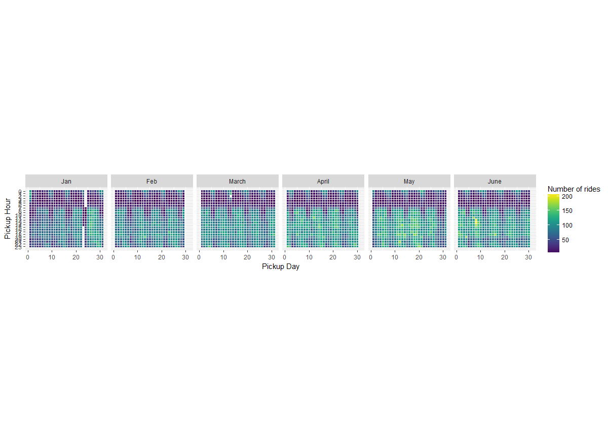

# Data visualization of taxi rides (R and Python)

R libraries (ggmap, ggplot) and Python's Folium package are used to visualize the taxi data set from Kaggle(https://www.kaggle.com/c/nyc-taxi-trip-duration). The goal is to explore and compare the different mapping features within R and Python.

### R visualization 
 
The dataset is relatively small in terms of number of features. Here's a glimps of the data:

|id|vendor_id|pickup_datetime|dropoff_datetime|passenger_count|pickup_longitude|pickup_latitude|dropoff_longitude|dropoff_latitude|store_and_fwd_flag|trip_duration|
|:-------------:|:-------------:|:-------------:|:-------------:|:-------------:|:-------------:|:-------------:|:-------------:|:-------------:|:-------------:|:-------------:|
|id2875421|2| 2016-03-14 17:24:55| 2016-03-14 17:32:30|1|-73.98215|40.76794|-73.96463|40.76560|N|455|
|id2377394|1| 2016-06-12 00:43:35| 2016-06-12 00:54:38|1|-73.98042|40.73856|-73.99948|40.73115|N|663|

The <i>Lubridate</i> library in R was helpful in extracting elements from the time stamp. A heatmap is generated showing the overall number of taxi pickups throughout the week (right plot), as well as a chart showing total number of taxi pickups by the hour (left plot).

   <b>Figure 1</b>. Plot of pickups throughout the hours and heatmap for weekday pickup patterns.

A more detailed heatmap was generated using ggplot's geom_tile() function. This one shows a better visual of the data array relating pickup hours with pickup date by the month.

   <b>Figure 2</b>. Temporal heatmap for number of pickups.

Note: for the python jupyter notebook (taxi_1.ipynb) it's best to view it on NBviewer because it renders the interactive maps. 
